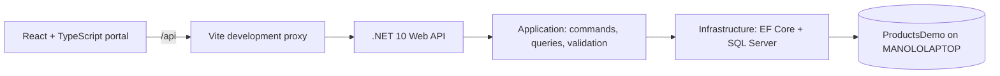
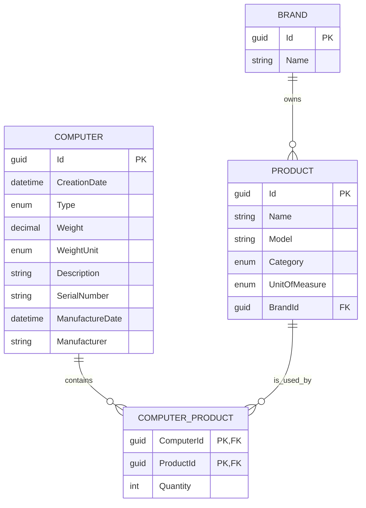

# Hardware Catalog Architecture Decisions

**Purpose:** Meeting notes that capture the current technical design, why the major choices were made, and the questions that should be reviewed before future expansion.

## Executive Summary

Hardware Catalog is a full-stack internal catalog application for managing reusable hardware products and composing them into computer configurations. It uses a .NET 10 REST API backed by SQL Server and a React 18 TypeScript portal.

The system favors explicit business rules and typed boundaries over dynamic behavior:

- The backend owns persistence, validation, product search, and configuration integrity.
- The frontend owns workflow usability, filter controls, type-ahead selection, and immediate feedback.
- SQL Server constraints and API checks protect relationship integrity even when callers bypass the portal.

## Solution Shape

### Backend Projects

| Project | Responsibility |
| --- | --- |
| `HardwareCatalog.Domain` | Entities and enums: `Brand`, `Product`, `Computer`, and `ComputerProduct`. |
| `HardwareCatalog.Application` | CQRS requests and handlers, DTOs, MediatR validation behavior, and search logic. |
| `HardwareCatalog.Infrastructure` | EF Core `ApplicationDbContext`, SQL Server configuration, migrations, design-time factory, and seed data. |
| `HardwareCatalog.WebApi` | HTTP controllers, DI, CORS, JSON configuration, OpenAPI endpoint, migration/startup seeding. |
| `HardwareCatalog.Tests` | Unit and handler tests using xUnit, FluentAssertions, Moq, and EF Core InMemory. |

### Frontend Structure

| Area | Responsibility |
| --- | --- |
| `src/services/api.ts` | Axios client, API operations, and TypeScript DTO contracts. |
| `src/hooks` | Reusable computer and product-search stateful operations. |
| `src/components` | Computer list and editor, product search, product maintenance. |
| `src/App.tsx` | Portal navigation and view composition. |

## Backend Decisions

### .NET 10 and ASP.NET Core Web API

**Decision:** Use .NET 10 with ASP.NET Core controllers and REST endpoints.

**Why:** It provides a supported modern runtime, first-party dependency injection, middleware, configuration, EF Core integration, and a clear HTTP boundary for the React portal. Controller endpoints keep the API approachable for CRUD and query use cases.

### MediatR and CQRS

**Decision:** Use MediatR 12 for commands and queries such as computer create/update/delete, computer reads, and product search.

**Why:**

- Commands separate state-changing work from read queries.
- Handlers localize use-case logic and are easier to test in isolation than controller-heavy logic.
- MediatR behaviors provide a central extension point for cross-cutting concerns, especially request validation.
- The pattern remains lightweight here: a command/query maps to a handler rather than introducing a separate service layer for every endpoint.

**Tradeoff:** CQRS adds types and indirection. It is justified because the application has integrity rules, search behavior, and multiple workflows. For a trivial single-entity CRUD application, direct controller-to-context access would be simpler.

### FluentValidation

**Decision:** Use FluentValidation 11 with dependency injection and a MediatR validation behavior.

**Why:**

- Validation rules are explicit and independently testable.
- Request validation runs consistently before handlers execute.
- Rules such as positive quantities and no duplicate `ProductId` entries do not get duplicated across controllers.
- FluentValidation yields user-facing messages appropriate for HTTP `400 Bad Request` responses.

**Defense in depth:** Validation is not the only protection. Handlers recheck important business invariants before persistence, and database keys/foreign keys protect the stored data.

### Entity Framework Core and SQL Server

**Decision:** Use EF Core 10 with the SQL Server provider and code-first migrations.

**Why:**

- The model has relational integrity requirements that are naturally expressed with keys and foreign keys.
- EF Core supports migrations, LINQ, relationship loading, and configuration in one .NET-native stack.
- SQL Server is appropriate for shared structured catalog data and Windows-integrated development environments.
- A design-time DbContext factory enables `dotnet ef` commands without depending on application startup.

**Connection choice:** The active runtime and design-time connection targets `ProductsDemo` on `MANOLOLAPTOP` using Windows authentication. `TrustServerCertificate=true` is present because the local SQL Server certificate chain is not trusted by the development machine. This is a local-development accommodation, not a production TLS recommendation.

### Native OpenAPI

**Decision:** Use `Microsoft.AspNetCore.OpenApi` 10.0.11 and map `/openapi/v1.json` in development.

**Why:** Earlier Swashbuckle versions caused .NET 10 compatibility failures. Native OpenAPI is first-party, version-aligned, and avoids third-party runtime mismatch risk. Consumers can load the schema into a compatible OpenAPI viewer when interactive documentation is needed.

### JSON String Enums

**Decision:** Configure `JsonStringEnumConverter` globally.

**Why:** The portal should receive meaningful values such as `Processor`, `Storage`, and `Desktop` instead of numeric enum values. This keeps API payloads readable and aligns TypeScript string enums with backend values.

### Natural-Language Product Search

**Decision:** Use a deterministic parser rather than an LLM for the current catalog search.

**Why:** The current domain has a finite vocabulary and structured filters. The parser recognizes:

- Category aliases, including singular/plural and compact API-style terms.
- Brand and name/model keywords.
- Capacity comparisons such as `more than 1TB`, `over 2 TB`, and `at least 512GB`.
- Request-intent words such as `show`, `return`, and `find`, which are ignored.

**Important behavior:** Filters compose by intersection. For example, `show me disk with more than 1TB` means storage products whose extracted capacity is greater than 1 TB; it must not union every word match.

**Why not an LLM yet:** A model adds credentials, cost, latency, observability concerns, and non-deterministic behavior. A future LLM can be an optional intent-extraction layer that produces a validated structured filter; it should not replace server-side authorization, validation, or deterministic query execution.

## Database Schema and Integrity

### Key Schema Choices

- `Brand` to `Product` is one-to-many. Product brand references are restricted from cascade deletion.
- `Computer` and `Product` use `ComputerProduct` as an explicit junction entity so it can carry `Quantity`.
- `ComputerProduct` has the composite primary key `(ComputerId, ProductId)`. A product can appear only once in a given computer configuration; its count is represented by `Quantity`.
- A product cannot be deleted if any `ComputerProduct` references it. The API returns `409 Conflict` before a delete reaches persistence.
- Product category is immutable after creation. The portal disables it during edits and the API rejects a changed category, protecting the meaning of existing configurations.

### Computer Configuration Rule

Every saved computer requires at least one product in each category:

1. Processor
2. Memory
3. Storage
4. Graphic card
5. Power supply
6. External port

Memory, storage, graphics cards, and ports support multiple distinct products. The UI prevents adding the same product twice, validation rejects duplicate IDs, handlers defensively recheck them, and the composite key remains the final database guarantee.

## Frontend Decisions

### React 18 and TypeScript 5

**Decision:** Use React 18 with strict TypeScript.

**Why:** React is appropriate for interactive form-heavy workflows. TypeScript provides a contract at the API boundary and catches stale props, mismatched enum values, and invalid component state earlier than runtime testing.

### Vite

**Decision:** Use Vite 5 with the React plugin.

**Why:** Vite offers fast startup and HMR for iterative UI work, while retaining a simple production build. Its development proxy sends `/api` traffic to `http://localhost:5199`, which avoids browser CORS friction and keeps frontend API calls environment-neutral.

### Axios

**Decision:** Use Axios as the portal HTTP client.

**Why:** A single configured client centralizes base URL, headers, typed responses, and error handling. It keeps components focused on state and interaction rather than request plumbing.

### Tailwind CSS

**Decision:** Use Tailwind CSS 3 for styling.

**Why:** Utility classes allow localized, predictable responsive styling without a separate stylesheet for every component. It has been used for dense operational tables, form controls, visible suggestion panels, and hover states.

### Type-Ahead and Filter Controls

**Decision:** Use custom visible suggestion panels rather than native HTML `datalist` for component selection and product filters.

**Why:** Native `datalist` behavior varies by browser and does not reliably present populated options on focus. The custom controls:

- Show available options immediately on focus.
- Filter by typed input.
- Provide hover feedback.
- Close on outside pointer interaction.
- Allow explicit item selection and duplicate prevention.

### Product Maintenance Workflow

**Decision:** Product maintenance is filter-first: select category, brand, or both before listing products.

**Why:** The catalog can grow; a filter-first list keeps a maintenance screen useful for scanning and prevents an unbounded initial table. When a category is selected, the brand filter is narrowed to brands that actually have products in that category. Changing either filter clears an active product editor so stale details cannot be saved against a different list context.

## Package and Test Choices

| Package or Tool | Decision Rationale |
| --- | --- |
| `MediatR` | Encapsulates commands/queries and supports pipeline behaviors. |
| `FluentValidation` | Declarative request validation with focused tests and reusable rules. |
| `Microsoft.EntityFrameworkCore.SqlServer` | SQL Server provider and relational persistence. |
| `Microsoft.EntityFrameworkCore.Design` | Supports migrations and design-time DbContext creation. |
| `Microsoft.AspNetCore.OpenApi` | .NET 10-aligned OpenAPI schema generation. |
| `xUnit` | Standard .NET unit-test runner. |
| `FluentAssertions` | Readable behavior-oriented test assertions. |
| `Moq` | Lightweight mocking for isolated tests where appropriate. |
| `EF Core InMemory` | Fast handler/query tests without depending on a live SQL Server instance. |
| `React` + `TypeScript` | Interactive UI with typed API contracts. |
| `Vite` | Fast local development and compact build pipeline. |
| `Axios` | Centralized typed HTTP client. |
| `Tailwind CSS` | Responsive, component-local styling with consistent state classes. |
| `ESLint` | Static checks for TypeScript/React code quality. |

## Operational Notes

- At startup, the Web API applies EF migrations and runs idempotent seed logic.
- Seed data includes brands, products, and a sample computer configuration for a usable first run.
- CORS is currently permissive (`AllowAnyOrigin`, `AllowAnyMethod`, `AllowAnyHeader`) for local development. This must be tightened before deployment.
- The API runs at `http://localhost:5199`; the Vite portal runs at `http://localhost:5173`.
- Product search, maintenance, and computer configuration rules are enforced by the API; frontend restrictions improve usability but are not trusted as the sole integrity mechanism.

## Critical Questions for Review

### Why MediatR instead of calling EF Core directly in controllers?

Because controllers should remain HTTP adapters. MediatR keeps use cases independently testable and supports shared pipeline behavior. The tradeoff is more files and indirection; if the domain remains extremely small, the team can revisit whether every use case needs a separate request/handler pair.

### Why FluentValidation when database constraints exist?

Database constraints are the final integrity guard, but they do not provide timely, field-specific feedback. FluentValidation returns actionable errors before work reaches persistence. Both are needed: API validation for usability and security, database constraints for correctness under every caller.

### Why is product category immutable?

Category defines the role a product plays in a computer configuration. Changing it after a product is used can invalidate required-category rules and make historical configurations ambiguous. Create a new product instead when a classification changes.

### Why use a junction table instead of a direct many-to-many relation?

The relationship has business data: `Quantity`. The explicit `ComputerProduct` entity makes that data first-class and permits the composite key that prevents duplicate product rows in one computer.

### Why prevent product deletion when it is used by a computer?

Deleting it would create dangling configuration references or erase historical meaning. The current policy is referential integrity over convenience. A future alternative is soft deletion or an `IsActive` flag for catalog retirement.

### Why use SQL Server rather than an in-memory or document database?

Computers, products, brands, and quantities have strong relational semantics, integrity requirements, and natural joins. SQL Server plus EF Core gives transactions, foreign keys, migrations, and established Windows development support.

### Why is `TrustServerCertificate=true` acceptable here?

It is acceptable only for the local development SQL Server instance where the certificate chain is not trusted. Production must use a certificate trusted by clients; do not carry this setting forward without a security review.

### Why not use an LLM for all product search?

The current search grammar is bounded and testable with deterministic parsing. An LLM would increase cost, latency, and uncertainty. Use one later only to translate richer natural language into a validated structured query, not to bypass the domain filters.

### Why use Vite instead of a larger React framework?

This is a client-side operational portal backed by a separate API. It does not currently need server-side rendering, route-level data loading, or a Node server runtime. Vite keeps the frontend small and fast; a framework such as Next.js can be reconsidered if SEO, SSR, or full-stack React needs emerge.

### Why does the backend apply migrations at application startup?

It reduces local setup friction and makes demo environments self-initializing. In production, migration execution should normally be a separate, controlled deployment step to avoid concurrent startup races and accidental schema changes.

### Is CORS `AllowAll` safe?

No. It is a local-development convenience. Production should explicitly allow trusted portal origins, methods, and headers, and should be reviewed together with authentication and authorization.

### Does the Application project have the ideal dependency direction?

The current application code references infrastructure persistence for EF-based handlers. This is pragmatic and compact, but a stricter Clean Architecture design would define repository/query interfaces in the application layer and implement them in infrastructure. That refactoring should be considered if the domain grows, multiple data sources are introduced, or unit-test isolation becomes more important.

## Follow-Up Decisions to Schedule

1. Define authentication and authorization roles for product maintenance versus computer configuration.
2. Decide whether product retirement should use soft deletion instead of hard deletion for unused products.
3. Move database migrations to a controlled deployment stage before production.
4. Tighten CORS and configure production TLS certificates.
5. Decide whether stricter repository abstractions are worth the additional complexity.
6. Define a structured search-filter contract if an optional LLM intent layer is introduced.
